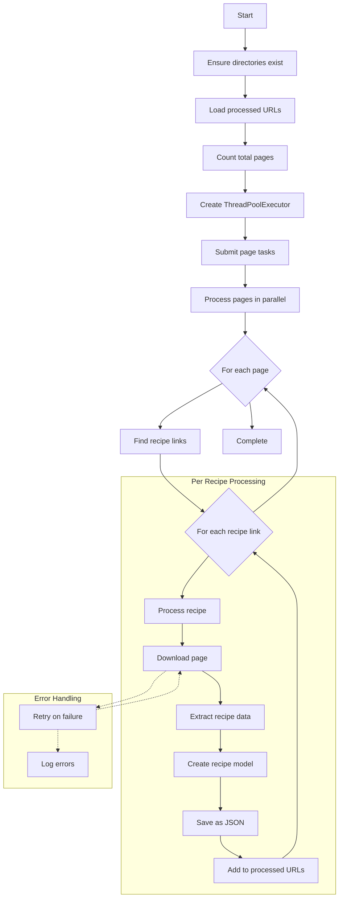

# 🍝 GialloZafferano Recipe Scraper 🍕

A robust, parallel scraper for collecting recipes from the popular Italian cooking website [GialloZafferano](https://www.giallozafferano.it/).

## ✨ Features

- 🚀 **Parallel Processing** - Downloads up to 10 pages simultaneously
- 🔄 **Resumable** - Continues from where it left off if interrupted
- 🧠 **Smart Error Handling** - Retries failed downloads automatically
- 📊 **Progress Tracking** - Visual progress bar and detailed logging
- 💾 **Structured Storage** - Saves recipes as clean JSON files

## 📋 Requirements

- Python 3.6+
- Required packages (see below)

## 🛠️ Installation

1. Clone the repository:

   ```bash
   git clone https://github.com/yourusername/GialloZafferano.git
   cd GialloZafferano
   ```

2. Install dependencies:
   ```bash
   python3 -m pip install -r requirements.txt
   ```

## 🚀 Usage

Simply run the main script:

```bash
python3 main.py
```

The script will create a `recipes` directory where all downloaded recipes will be stored as JSON files.

A log file (`scraper.log`) will be created to track the scraping process.

## 🔄 Application Flow



## 📊 Data Structure

Recipes are saved as JSON files with the following structure:

- **title**: Recipe title
- **link**: Original URL
- **ingredients**: List of ingredients with names and quantities
- **description**: Cooking instructions
- **category**: Recipe category
- **image**: Base64-encoded image
- **difficulty**: Difficulty level
- **preparationTime**: Preparation time
- **cookingTime**: Cooking time
- **servings**: Number of servings
- **price**: Cost indicator
- **nutritionals**: Nutritional information
- **vegetarian**: Whether the recipe is vegetarian
- **lactoseFree**: Whether the recipe is lactose-free

## 📝 Logs

The application creates detailed logs in `scraper.log` that track:

- 📄 Pages processed
- 🍲 Recipes downloaded
- ⚠️ Warnings and errors
- ⏱️ Performance information
